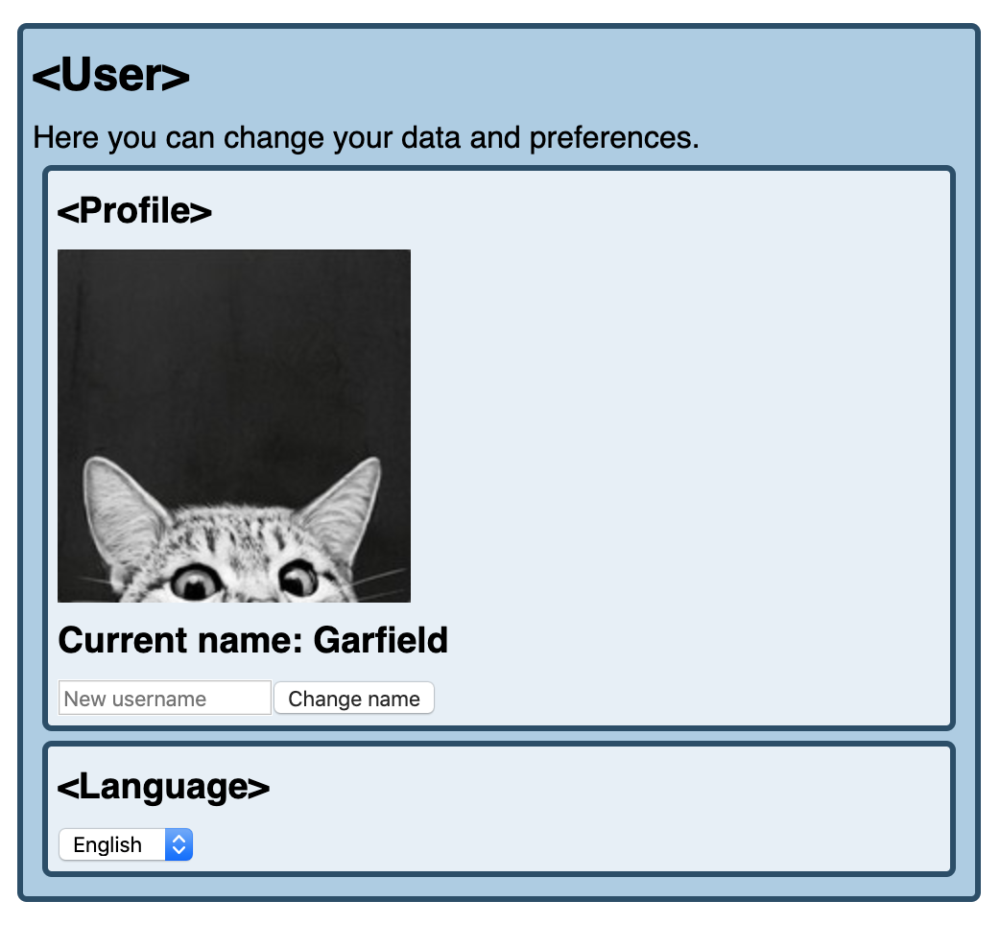

Hooks are introduced in React 16.8 and simplified our class-based React components allowing us to use state and other React features (like managing life cycle methods) in function component. In this article I assume you're quite familiar with React's hooks and you're able to write your own custom hook. Otherwise I can refer you to official React's documentation: [Introducing Hooks](https://reactjs.org/docs/hooks-intro.html).

With Hooks it's easy to share reusable logic between function components. Another great advantage of Hooks is availability to write your own custom hooks. If your custom hook is not trivial and used in few places covering all of it use cases by tests in every component can be challenging. In this article I will cover examples of testing new Context API (introduces in React 16.3) combined with hooks.

Let's suppose we've got React application with User Component where we can change our user data.



User is a main component that wraps inside two sub-components:
* Profile component where we can see image and name of our user and we have option to change our user name:

```jsx
// Profile.js
import React, { useRef } from "react";

import { useUser } from "../hooks/UserContext";

export default () => {
  const { user, setUserName } = useUser();
  const defaultInputName = "";
  const inputName = useRef(defaultInputName);

  const handleChange = () => {
    setUserName(inputName.current.value);
    inputName.current.value = defaultInputName; // resets input after submit
  };

  return (
    <div className="box">
      <h3>Profile</h3>
      
      <h3>Current name: {user.name}</h3>
      <div>
        <input
          data-testid="username"
          type="text"
          ref={inputName}
          placeholder="New username"
          maxlength="20"
        />
        <button type="button" onClick={handleChange} value="Change">
          Change name
        </button>
      </div>
    </div>
  );
};

```

* Language component where we can select preferred user language from predefined options:

```jsx
// Language.js
import React from "react";

import { useLanguage } from "../hooks/LanguageContext";

export default () => {
  const { language, setLanguage } = useLanguage();

  const handleSelectChange = event => setLanguage(event.target.value);

  return (
    <div className="box">
      <h3>Language</h3>
      <select
        data-testid="languageSelect"
        value={language}
        onChange={handleSelectChange}
      >
        <option value="pl">Polish</option>
        <option value="en">English</option>
        <option value="de">German</option>
      </select>
    </div>
  );
};

```

We've got also two Contexts related with those sub-components:
* UserContext which exports `UserProvider` and `useUser()` hook:

```jsx{7,15}
//UserContext.js
import React, { useState, useContext, createContext } from "react";
import PropTypes from "prop-types";

const UserContext = createContext();

export const useUser = () => {
  const context = useContext(UserContext);
  if (context === undefined) {
    throw new Error("useUser must be used within a UserProvider");
  }
  return context;
};

export const UserProvider = props => {
  const [user, setUser] = useState(props.user);

  const setUserName = name =>
    setUser({ ...user, name: name.trim() || user.name });

  const value = {
    user,
    setUserName
  };

  return (
    <UserContext.Provider value={value}>{props.children}</UserContext.Provider>
  );
};

UserProvider.propTypes = {
  user: PropTypes.shape({
    name: PropTypes.string.isRequired,
    image: PropTypes.string.isRequired
  })
};

```

* LanguageContext which exports `LanguageProvider` and `useLanguage()` hook:

```jsx{7,15}
// LanguageContext.js
import React, { useState, useContext, createContext } from "react";
import PropTypes from "prop-types";

const LanguageContext = createContext();

export const useLanguage = () => {
  const context = useContext(LanguageContext);
  if (context === undefined) {
    throw new Error("useLanguage must be used within a LanguageProvider");
  }
  return context;
};

export const LanguageProvider = props => {
  const [language, setLanguage] = useState(props.language);

  const value = {
    language,
    setLanguage
  };

  return (
    <LanguageContext.Provider value={value}>
      {props.children}
    </LanguageContext.Provider>
  );
};

LanguageProvider.propTypes = {
  language: PropTypes.string.isRequired
};

```

